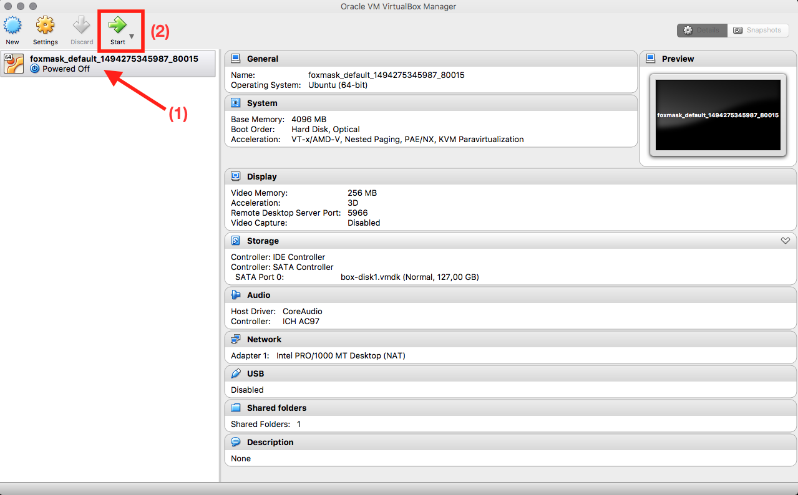
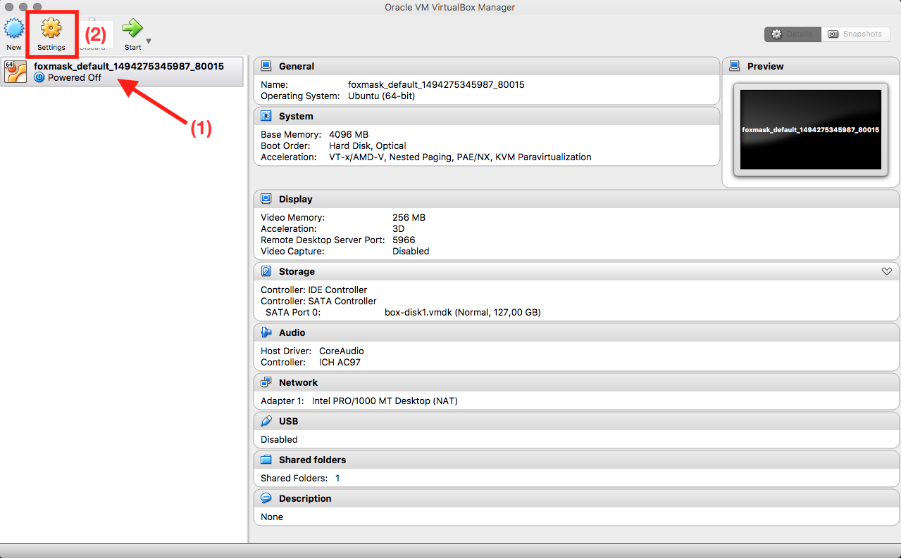
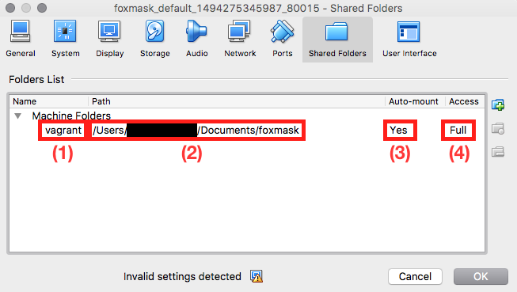

# FoxMask

A Python program to automatically detect moving objects on images


### What is it?

FoxMask has been created to give user a tool to automatically analyze images taken by RECONYX cameras. Theses cameras are triggered by a motion detection system and FoxMask has been written to be able to isolate moving objects with very short image sequences (minimum of 5). It is written in Python and depends on C++ libraries.


### Hardware requirements

This Python program is intended to be used within a virtual environment including an Ubuntu 14.04 Vagrant box. To run this virtual environment, you need at least 13 GB of free disk space and 4 GB of RAM.

**Note:** virtualization needs to be enabled for your CPU.


### Installation

Three open-source softwares need to be installed on your computer:

- [VirtualBox v.5.1](https://www.virtualbox.org/), to manage virtual environments;
- [Vagrant](https://www.vagrantup.com/), to unpack the Ubuntu 14.04 Box (including Linux Ubuntu 14.04, Python 2.7 and its required modules);
- [git](https://git-scm.com/), to clone (download) the actual repository (including FoxMask program and C++ dependencies).

Once theses softwares are installed, you can proceed to install the FoxMask Box on your computer. Two steps are required: 1) clone this repository and 2) install the FoxMask Box.

Open the command-line interpreter of your OS (the shell on Unix-like systems or the cmd on Windows), and select the directory where you want to download the repository. For instance, if you want to select the **Documents/** folder:

- Windows

```bash
cd C:/Users/<username>/Documents
```

- Unix-like systems

```bash
cd /Users/<username>/Documents
```

Make sure you change `<username>` by your real user name.

Then you can clone the repository:

```bash
git clone https://github.com/edevost/foxmask.git
```

And download, unpack and install the FoxMask Box:

```bash
cd foxmask
vagrant up
```

At the end of the installation, the virtual box is automatically launched. If not, open VirtualBox and run the FoxMask Box by 1) selecting the box, and 2) clicking on the _Start_ button (`Screenshot #1`). You will see the Ubuntu 14.04 interface. In this virtual environment, your user name is **vagrant** and the associated password is **vagrant**.



_Screenshot \#1: FoxMask Box Launch_

### Configuration

Before using FoxMask, a final configuration step is necessary. Make sure you have opened and closed FoxMask Box at least once.

1. **Shared folder**

The idea is to authorize the repository clone on the host OS (your computer) to be directly accessible by the guest OS (FoxMask Box). This is very useful to put images to be analyzed.

Open VirtualBox and access the FoxMask Box settings (`Screenshot #2`).



_Screenshot \#2: Open FoxMask Box settings_

Then, make sure the settings look like the `Screenshot #3`.



_Screenshot \#3: Authorize shared folder between host and guest OS_


2. **Folder permissions**

Secondly, you have to modify permissions of two folders: 1) the shared folder (named `sf_vagrant`, located on the `/media` folder) and another folder located at the root of the guest OS (named `vagrant`). Type the following command lines on the Ubuntu shell:

```bash
sudo usermod -aG vboxsf vagrant
sudo chmod -R ugo+rw /media/sf_vagrant
sudo chmod -R ugo+rw /vagrant
```

**Important:** restart the guest OS (Ubuntu) for the changes to take affect.

Now, you can access the content of the shared folder, i.e. the foxmask repository (`sf_vagrant`) from the guest OS.

3. **Symbolic link**

To be run FoxMask needs to be located at the `/vagrant` folder. But, this is not a shared folder. So we will create a symbolic link between the shared folder `/media/sf_vagrant` and the folder `/vagrant`. Type the following command lines on the Ubuntu shell:

```bash
sudo rm -r /vagrant
sudo ln -s /media/sf_vagrant/ /
sudo mv /sf_vagrant /vagrant
```

Now, all the content of the shared folder is also accessible from the `/vagrant` folder. If you add/modify/delete a file from `/vagrant`, changes will be passed on the shared folder `/media/sf_vagrant` and the repository clone on your host OS (like using Dropbox with one single account from different platforms). For instance, if you copy images on the shared folder in the host OS, these files will be accessible both via the `/media/sf_vagrant` and `/vagrant` folders of Ubuntu.

### Usage

This software is shipped with a sample images directory (**images/example/**) where you will find 50 images of Arctic fox. FoxMask consists of two Python scripts:

- `parameters.py`, ...
- `foxmask.py`, ...


### Licensing

Please see the file called LICENSE.


### Contact

Feel free to contact me if you have any comments or questions at ericdevost@gmail.com


### Reference

Devost É, Casajus N, Lai S & Berteaux D (9999) FOXMASK: a new automated tool for animal screening on camera trap images. **Methods in Ecology and Evolution**, submitted.
